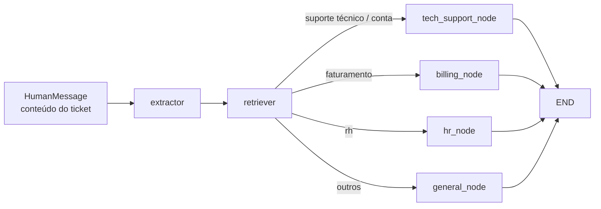

# TonhãoDesk — Sistema de Helpdesk com IA

Sistema de gerenciamento de tickets de suporte com agente de IA integrado. Ao abrir um chamado, um pipeline de IA classifica automaticamente o ticket, busca contexto relevante na base de conhecimento (RAG) e gera uma resposta inicial. Atendentes humanos podem então acompanhar, editar a resposta da IA, atualizar status/prioridade e encerrar o ticket.

---

## Índice

- [Funcionalidades](#funcionalidades)
- [Tecnologias](#tecnologias)
- [Arquitetura do Agente de IA](#arquitetura-do-agente-de-ia)
- [Pré-requisitos](#pré-requisitos)
- [Configuração](#configuração)
- [Como Executar](#como-executar)
- [Endpoints da API](#endpoints-da-api)
- [Estrutura do Projeto](#estrutura-do-projeto)
- [Base de Conhecimento](#base-de-conhecimento)

---

## Funcionalidades

- **Gestão de tickets**: criação, listagem, atualização e exclusão de chamados com filtros por status, prioridade, categoria e busca textual
- **Threads de respostas**: histórico de respostas por ticket com distinção entre respostas humanas e da IA
- **Resposta automática por IA**: ao criar um ticket, o agente processa e responde automaticamente em background
- **RAG (Retrieval-Augmented Generation)**: a IA consulta uma base de conhecimento categorizada antes de responder
- **Memória de conversa**: histórico de mensagens por ticket via checkpoints do LangGraph
- **Autenticação**: login por credenciais ou Google OAuth 2.0 com cookie HttpOnly
- **Controle de acesso por papel**: clientes veem apenas seus próprios tickets; atendentes visualizam e gerenciam todos
- **Upload de arquivos**: suporte a imagens e PDFs (até 10 MB) anexados ao ticket

---

## Tecnologias

### Backend

| Camada | Tecnologia |
|---|---|
| Framework | FastAPI (Python ≥ 3.12) |
| ORM / Banco de dados | SQLAlchemy 2 + SQLite + Alembic |
| Autenticação | JWT (python-jose) + bcrypt + Google OAuth 2.0 |
| Orquestração de IA | LangGraph (StateGraph) |
| Provedor de LLM | Google Gemini / Gemma (`langchain-google-genai`) |
| Banco vetorial | ChromaDB (persistente) |
| Embeddings | `sentence-transformers` — `paraphrase-multilingual-MiniLM-L12-v2` |
| Parsing de PDF | pypdf |
| Configuração | python-dotenv |
| Servidor | Uvicorn |

### Frontend

| Camada | Tecnologia |
|---|---|
| Framework | React 19 + TypeScript |
| Build | Vite |
| Roteamento | React Router DOM v7 |
| Estado do servidor | TanStack React Query v5 |
| Formulários | React Hook Form + Zod |
| HTTP | Axios |
| Estilização | Tailwind CSS v4 |
| Ícones | lucide-react |
| Servidor web (prod) | Nginx (via Docker) |

---

## Arquitetura do Agente de IA

O agente é um **`StateGraph` do LangGraph** compilado como singleton, com checkpointing em SQLite para manter memória de conversa por ticket (`thread_id = ticket_id`).

### Fluxo do grafo



### Nós do grafo

| Nó | Modelo | Função |
|---|---|---|
| **Extractor** | `gemma-4-31b-it` (temp 0.3) | Extrai título, descrição, categoria canônica e última pergunta sem resposta de forma estruturada |
| **RetrieverNode** | — (sem LLM) | Consulta a coleção ChromaDB correspondente com `n_results=3` via embeddings multilíngues |
| **TechNode** | `gemini-3.1-flash-lite` (temp 0.5) | Gera resposta de suporte técnico com base no contexto RAG |
| **HRNode** | `gemma-4-31b-it` (temp 0.5) | Gera resposta sobre RH com base no contexto RAG |
| **BillingNode** | `gemma-4-31b-it` (temp 0.5) | Gera resposta sobre faturamento com base no contexto RAG |
| **GeneralNode** | `gemini-2.5-flash-lite` (temp 0.5) | Gera resposta geral / fallback |

### Coleções ChromaDB

| Coleção | Pasta de conhecimento |
|---|---|
| `tech` | `knowledge/tech/` |
| `billing` | `knowledge/billing/` |
| `hr_support` | `knowledge/hr/` |
| `general` | `knowledge/general/` |

---

## Pré-requisitos

- [Docker](https://www.docker.com/) e Docker Compose (para execução via container)
- **ou** Python ≥ 3.12 + Node.js ≥ 18 (para desenvolvimento local)
- Chave de API do [Google Gemini](https://aistudio.google.com/)

---

## Configuração

Crie o arquivo `.env` dentro da pasta `backend/`:

```env
# Obrigatório
GEMINI_API_KEY=sua_chave_aqui

# Google OAuth (opcional)
GOOGLE_CLIENT_ID=
GOOGLE_CLIENT_SECRET=

# URLs
FRONTEND_URL=http://localhost:5173
BACKEND_URL=http://localhost:8000

# Caminhos (valores padrão para Docker)
DATABASE_URL=sqlite:////data/tonhao.db
CHECKPOINT_DB_PATH=/data/checkpoints.db
CHROMA_PATH=/data/chroma_db
UPLOADS_DIR=/data/uploads
KNOWLEDGE_PATH=/app/knowledge

# Ambiente
ENVIRONMENT=development
```

> Em produção, defina `ENVIRONMENT=production` para ativar cookies seguros (HTTPS).

---

## Como Executar

### Com Docker (recomendado)

```bash
# Na raiz do projeto
docker-compose up --build
```

- **Backend**: `http://localhost:8000`
- **Frontend**: `http://localhost:80`
- **Documentação da API (Swagger)**: `http://localhost:8000/docs`

Os dados (banco SQLite, ChromaDB, uploads e checkpoints do LangGraph) são persistidos no volume Docker `tonhao-data`.

### Desenvolvimento local

**Backend:**
```bash
cd backend
python -m venv .venv
# Windows
.venv\Scripts\activate
# Linux/macOS
source .venv/bin/activate

pip install -e .
# ou com uv:
uv sync

uvicorn app:app --reload
# ou: fastapi dev app.py
```

**Frontend:**
```bash
cd frontend
npm install
npm run dev
# → http://localhost:5173
```

**Popular banco de dados (agentes/dados de exemplo):**
```bash
cd backend
python seed.py
```

---

## Endpoints da API

### Autenticação — `/auth`

| Método | Rota | Descrição |
|---|---|---|
| POST | `/auth/register` | Criar conta (papel `client` por padrão) |
| POST | `/auth/login` | Autenticar e receber cookie JWT |
| POST | `/auth/logout` | Encerrar sessão |
| GET | `/auth/me` | Dados do usuário autenticado |
| GET | `/auth/google` | Iniciar fluxo OAuth Google |
| GET | `/auth/google/callback` | Callback do OAuth Google |

### Tickets — `/tickets` (requer autenticação)

| Método | Rota | Papel | Descrição |
|---|---|---|---|
| GET | `/tickets` | qualquer | Listar tickets (paginado, com filtros) |
| POST | `/tickets` | qualquer | Criar ticket + upload de arquivo (dispara IA em background) |
| GET | `/tickets/{id}` | qualquer | Detalhe do ticket |
| PATCH | `/tickets/{id}` | agent | Atualizar status / prioridade / categoria |
| DELETE | `/tickets/{id}` | agent | Excluir ticket |
| GET | `/tickets/{id}/replies` | qualquer | Listar respostas do ticket |
| POST | `/tickets/{id}/replies` | qualquer | Adicionar resposta humana |
| PATCH | `/tickets/{id}/replies/{rid}` | agent | Editar corpo de resposta da IA |

### Arquivos estáticos

| Método | Rota | Descrição |
|---|---|---|
| GET | `/uploads/{filename}` | Servir anexos dos tickets |

---

## Estrutura do Projeto

```
tonhao-IA/
├── docker-compose.yml
├── backend/
│   ├── app.py                   # Ponto de entrada FastAPI
│   ├── pyproject.toml
│   ├── seed.py / seed.sql       # Dados iniciais
│   ├── knowledge/               # Base de conhecimento (arquivos .md)
│   │   ├── billing/
│   │   ├── general/
│   │   ├── hr/
│   │   └── tech/
│   ├── migrations/              # Migrações Alembic
│   └── src/
│       └── modules/
│           ├── agent/           # Pipeline LangGraph
│           │   ├── graph.py
│           │   ├── nodes/       # Nós do grafo (extractor, retriever, domínios)
│           │   └── rag/         # Ingestão e recuperação vetorial
│           ├── auth/            # Autenticação JWT + Google OAuth
│           └── ticket/          # CRUD de tickets e respostas
└── frontend/
    └── src/
        ├── pages/               # Login, Register, Dashboard, CreateTicket, TicketDetail
        ├── components/          # Layout, badges, cards, ui/
        ├── api/                 # Chamadas Axios (auth, tickets)
        └── context/             # AuthContext
```

---

## Base de Conhecimento

Os documentos da base de conhecimento ficam em `backend/knowledge/` organizados por categoria. A ingestão ocorre automaticamente na inicialização da aplicação — todos os arquivos `.md` são divididos por seções (`##`) e indexados no ChromaDB.

Para adicionar ou atualizar conteúdo, basta editar ou criar arquivos `.md` nas subpastas correspondentes e reiniciar a aplicação.

```
knowledge/
├── billing/        → informações de faturamento e cobranças
├── general/        → perguntas frequentes gerais
├── hr/             → políticas e informações de RH
└── tech/           → guias de troubleshooting técnico
```
